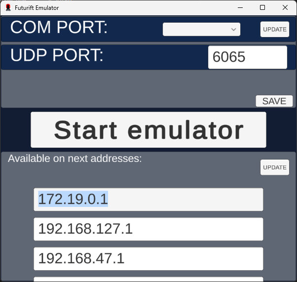
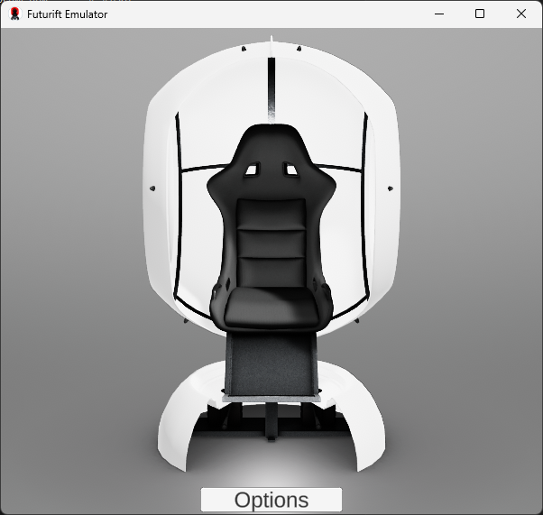

# FutuRIFT \ - Controller/The emulator

[Rus](README.md) | [Eng](README.en.md)

## Description

This project is designed to control the FutuRIFT device via the UDP port.
To configure the listening port, open the options page.

On this page, you can specify the COM port number for controlling the actual FutuRIFT device connected to the PC.

If the FutuRIFT device is not connected, the project can be used as an emulator.

## License

This project is licensed under the MIT license \ - for details, see. in the LICENSE\file.

## Contacts

FutuRIFT Controller / Emulator \ is a project of the RTU IT LAB department and developed by Kirill Shutov, an RTU TVP student. If you have any questions, please contact me by email: <i@shutovks.ru>.

## Screenshots

