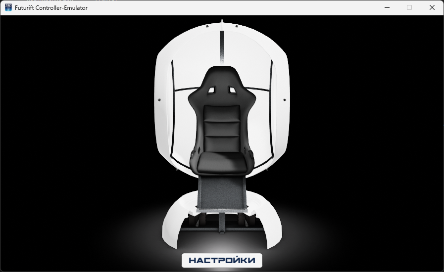

# Futurift Controller/Emulator

[Rus](README.md) | [Eng](README_ENG.md)

## Описание

Вот перевод текста на русский язык:

Этот проект может слушать UDP-порт для управления устройством Futurift.

Порт для прослушивания можно настроить на странице опций, которая открывается первым.

Все опции будут сохраняться рядом с исполняемым файлом в файле `options.json`.

На странице опций вы можете указать номер COM-порта для контроля реального устройства Futurift, подключенного к ПК.

Если нет подключенного устройства Futurift, то проект может использоваться как эмулятор.

## Лицензия

Этот проект лицензирован под лицензией MIT - подробности см. в файле LICENSE.

## Контакты

Futurift Controller/Emulator - это проект отдела RTU IT LAB и доработанного студентом RTU TVP Шутовым Кириллом. Если у вас есть вопросы, пожалуйста, свяжитесь со мной по электронной почте: <i@shutovks.ru>.

## Скриншоты

