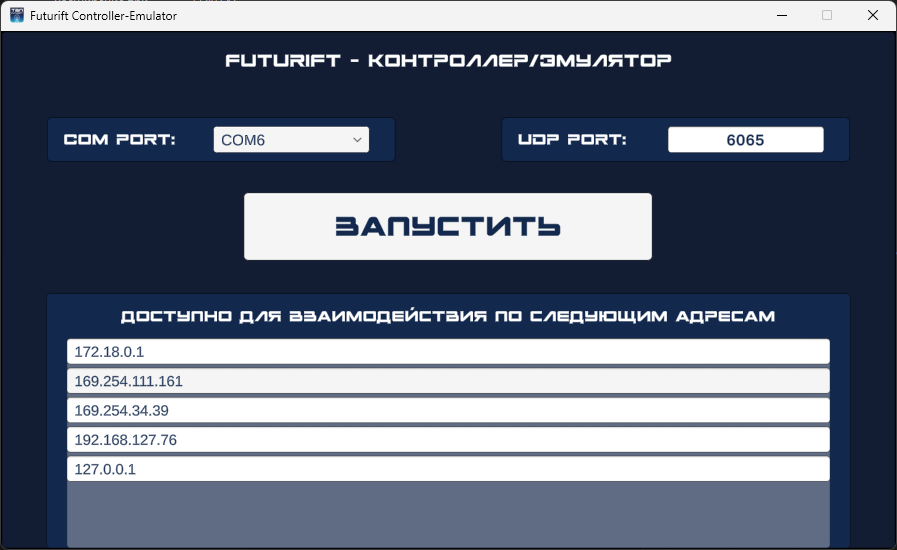

# Futurift Controller/Emulator

[Rus](README.md) | [Eng](README_ENG.md)

## Description

This project can listen to a UDP port for controlling a Futurift device.

The listening port can be set on the options page, which opens first.

All options will be saved next to the executable file in the `options.json` file.

On the options page, you can specify the COM port number for controlling a real Futurift device connected to a PC.

If there is no connected Futurift device, the project can be used as an emulator.

## License

This project is licensed under the MIT license - details can be found in the LICENSE file.

## Contacts

Futurift Controller/Emulator is a project from the RTU IT LAB department and was further developed by RTU TVP student Shutov Kirill. If you have any questions, please contact me at <i@shutovks.ru>.

## Screenshots

